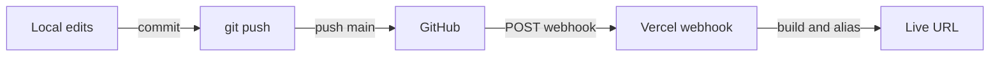

# hello-technest

A minimal **Technest Week 1** personal landing page: Vite + React, versioned on GitHub, deployed to production on every push to `main`.

**Live site:** [technest-week-1.vercel.app](https://technest-week-1.vercel.app) · **Repository:** [github.com/kaybee77/hello-technest](https://github.com/kaybee77/hello-technest)

> **Preview:** Open the live URL above for the current production build. (You can add an in-repo screenshot later, e.g. `docs/preview.png`, and reference it here with ``.)

## Tech stack

| Piece | What we picked | Why |
|--------|----------------|-----|
| UI | **React 19** | Component model and ecosystem fit a small page that may grow later. |
| Bundler / dev server | **Vite 8** | Very fast local feedback (HMR) and a simple `npm run build` → static `dist/` output. |
| Hosting | **Vercel** | Static hosting on the edge, automatic builds from GitHub, preview/production flows. |
| Repo layout | **App in `hello-technest/`, root `vercel.json`** | Keeps the Vite app in a subfolder while Vercel installs and builds from the repo root. |
| Version control | **Git + GitHub** | Standard collaboration, history, and the webhook that triggers Vercel. |

## Run locally

```bash
cd hello-technest
npm install
npm run dev
```

Then open the URL Vite prints (typically `http://localhost:5173`).

**Production build (optional sanity check):**

```bash
cd hello-technest
npm run build
npm run preview
```

## Deploy pipeline

Pushes to `main` on GitHub trigger a production deployment on Vercel (Git integration). Root [`vercel.json`](vercel.json) runs install/build inside `hello-technest/` and publishes `hello-technest/dist`.



## Repository layout

```text
.
├── hello-technest/     # Vite + React app (source)
├── vercel.json         # Vercel install/build/output paths
└── README.md           # This file
```

## License

No `LICENSE` file in this repository unless you add one.
